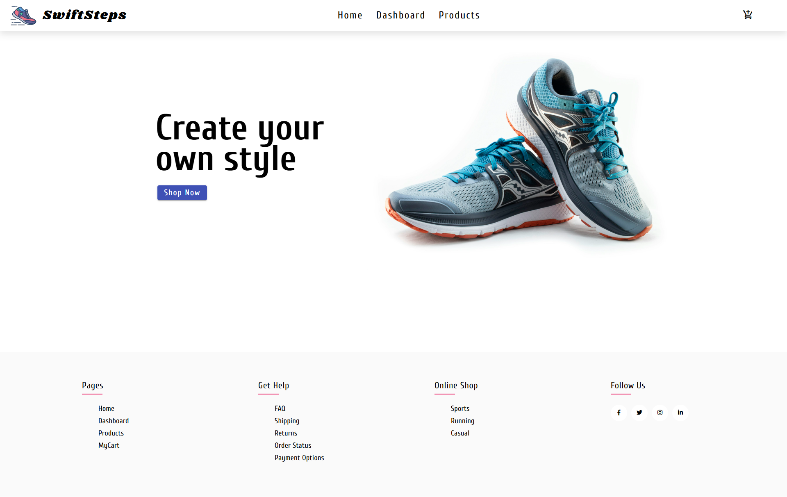
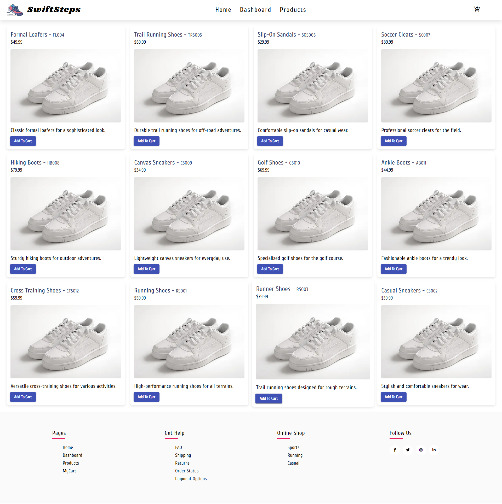
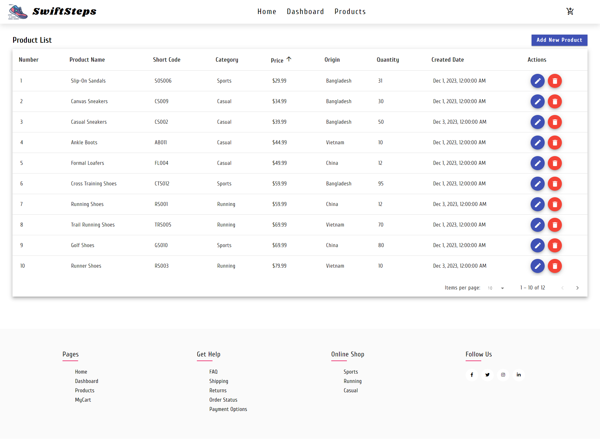
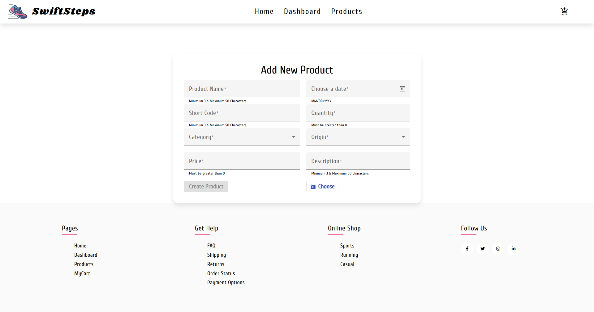
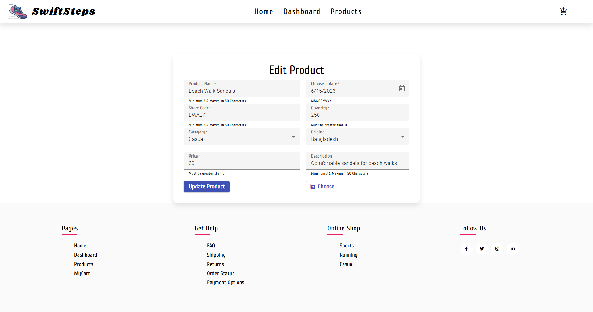
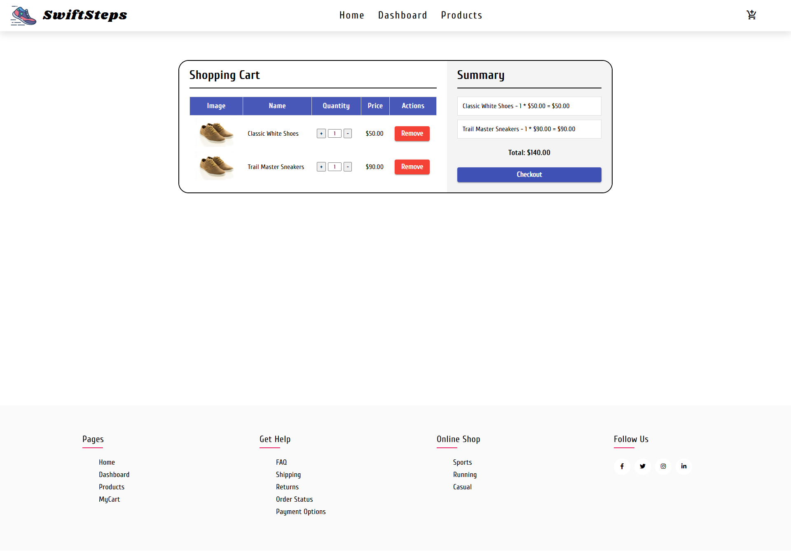

# SwiftSteps - E-commerce Website

## Project Overview

SwiftSteps is an E-commerce web application designed to provide a user-friendly interface for managing products, handling shopping cart functionality, and facilitating product purchase. The entire project is centered around basic CRUD (Create, Read, Update, Delete) operations, enabling administrators to manage products, categories and orders efficiently.

## Features

### 1. User Roles

- **Admin:** The application has a single admin role, allowing privileged access to manage products.

### 2. Pages

- **Home:** Landing page providing an overview of the application.
- **Dashboard:** Displays all products in card view with an option to add them to the cart.
- **Products:** Shows a table with product information, allowing admin to edit or delete products.
- **Cart:** Lists all products added to the cart, enabling admin to adjust quantities and remove items.

### 3. Dashboard

- Products are showcased in a card view with an intuitive add-to-cart button.

### 4. Products Page

- Table displaying product details with options for editing and deleting products.
- Server-side pagination and sorting for efficient data handling.
- Admin can add new products through an Angular reactive form.

### 5. Cart

- Displays all products added to the cart.
- Admin can increment, decrement, or remove items.
- Checks product availability before purchase.
- Updates product quantity in the database post-purchase.

## Technologies Used

- **Frontend:** Angular
- **Backend:** Node.js, Express.js
- **Database:** MongoDB

## Screenshots

Home

Dashbaord

Products

Add Product

Update Product

Cart

## Installation

1. Clone the repository: `git clone https://github.com/Bayzed-Meer/SwiftSteps.git`
2. Navigate to the project directory: `cd SwiftSteps`
3. Install dependencies:

   cd client

   npm install

   cd server

   npm install

4. Usage :

   cd server

   npm start

   cd client

   ng serve

5. Open the application in your browser: http://localhost:4200/
